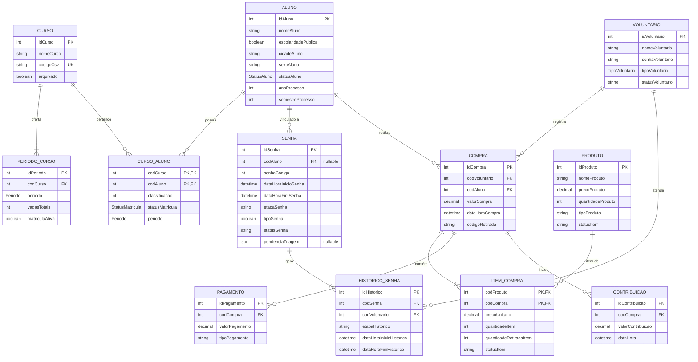

# Referência do Modelo Lógico — SIGA Phila

Este documento registra a especificação consolidada do **Modelo Lógico de Dados** do sistema **SIGA Phila**, refletindo todas as decisões arquiteturais tomadas para o banco de dados PostgreSQL gerenciado via Prisma ORM.

---

## 1. Diagrama Entidade-Relacionamento



---

## 2. Dicionário de Dados das Entidades

### 2.1. Aluno (`Aluno`)
Armazena os estudantes candidatos à vaga ou matriculados.
*Não utiliza CPF como chave nem como identificador público.*

| Coluna | Tipo | Restrições | Finalidade / Descrição |
| :--- | :--- | :--- | :--- |
| `idAluno` | `Int` | PK, Auto-increment | Identificador único interno do aluno. |
| `nomeAluno` | `VarChar(100)` | Not Null | Nome completo do estudante (campo principal de busca textual). |
| `escolaridadePublica` | `Boolean` | Not Null, Default: `false` | Indica se o aluno utilizou cota de escola pública no Vestibulinho. |
| `cidadeAluno` | `VarChar(100)` | Nullable | Cidade de residência do aluno. |
| `sexoAluno` | `VarChar(20)` | Nullable | Sexo/gênero registrado. |
| `statusAluno` | `Enum StatusAluno`| Not Null, Default: `CANDIDATO` | Situação: `CANDIDATO`, `ATIVO` ou `ARQUIVADO`. |
| `anoProcesso` | `Int` | Nullable | Ano do processo seletivo (ex: `2026`). |
| `semestreProcesso` | `Int` | Nullable | Semestre letivo do processo (ex: `1` ou `2`). |

---

### 2.2. Curso (`Curso`)
Catálogo de cursos técnicos e integrados oferecidos pela unidade.

| Coluna | Tipo | Restrições | Finalidade / Descrição |
| :--- | :--- | :--- | :--- |
| `idCurso` | `Int` | PK, Auto-increment | Identificador único do curso. |
| `nomeCurso` | `VarChar(100)` | Not Null | Nome oficial do curso. |
| `codigoCsv` | `VarChar(50)` | Unique, Nullable | Código correspondente utilizado na importação do Vestibulinho. |
| `arquivado` | `Boolean` | Not Null, Default: `false` | Indica se o curso está inativo para novas ofertas. |

---

### 2.3. Período do Curso (`PeriodoCurso`)
Oferta de turnos e controle de vagas disponíveis por curso.

| Coluna | Tipo | Restrições | Finalidade / Descrição |
| :--- | :--- | :--- | :--- |
| `idPeriodo` | `Int` | PK, Auto-increment | Identificador único da oferta. |
| `codCurso` | `Int` | FK -> `Curso(idCurso)` | Chave estrangeira do curso ofertado. |
| `periodo` | `Enum Periodo` | Not Null | Turno: `manha`, `tarde`, `noite`, `integral`, `online`. |
| `vagasTotais` | `Int` | Not Null | Quantidade total de vagas autorizadas para o período. |
| `matriculaAtiva` | `Boolean` | Not Null, Default: `true` | Determina se o período aceita matrículas no momento. |

*Chave Única Composta:* `@@unique([codCurso, periodo])` (impede períodos repetidos no mesmo curso).

---

### 2.4. Matrícula do Aluno no Curso (`CursoAluno`)
Tabela associativa entre Aluno e Curso, representando a inscrição no processo.

| Coluna | Tipo | Restrições | Finalidade / Descrição |
| :--- | :--- | :--- | :--- |
| `codCurso` | `Int` | PK, FK -> `Curso(idCurso)` | Código do curso em que o aluno concorre/estuda. |
| `codAluno` | `Int` | PK, FK -> `Aluno(idAluno)` | Código do aluno correspondente. |
| `classificacao` | `Int` | Nullable | Posição de classificação no processo seletivo. |
| `statusMatricula` | `Enum StatusMatricula` | Not Null, Default: `PENDENTE` | Situação da matrícula: `PENDENTE` ou `ATIVA`. |
| `periodo` | `Enum Periodo` | Nullable | Turno escolhido ou alocado para o aluno. |

---

### 2.5. Senha de Atendimento (`Senha`)
Controle das senhas emitidas para o fluxo presencial do dia.

| Coluna | Tipo | Restrições | Finalidade / Descrição |
| :--- | :--- | :--- | :--- |
| `idSenha` | `Int` | PK, Auto-increment | Identificador único sequencial do registro da senha. |
| `codAluno` | `Int` | FK -> `Aluno(idAluno)`, Nullable | Aluno associado à senha (preenchido no Posto de Triagem). |
| `senhaCodigo` | `Int` | Not Null | Número da senha exibido no ticket e painel (reiniciado diariamente). |
| `dataHoraInicioSenha` | `DateTime` | Not Null | Momento exato em que a senha foi emitida no Totem. |
| `dataHoraFimSenha` | `DateTime` | Nullable | Momento em que a senha concluiu o último posto ou foi cancelada. |
| `etapaSenha` | `VarChar(15)` | Not Null | Posto atual da senha: `'triagem'`, `'apm'`, `'docs'`. |
| `tipoSenha` | `Boolean` | Not Null, Default: `false` | Indicador de prioridade (`false` = normal, `true` = prioritária). |
| `statusSenha` | `VarChar(20)` | Not Null | Estado da senha: `'aguardando'`, `'em_atendimento'`, `'pendente'`, `'finalizada'`, `'cancelada'`. |
| `pendenciaTriagem` | `Json` | Nullable | Registro de pendências documentais da Triagem (lista de documentos e data). |

---

### 2.6. Histórico de Atendimento da Senha (`HistoricoSenha`)
Rastreamento de cada passagem da senha por um guichê e atendente para cálculo de tempos (TME e TMA).

| Coluna | Tipo | Restrições | Finalidade / Descrição |
| :--- | :--- | :--- | :--- |
| `idHistorico` | `Int` | PK, Auto-increment | Identificador único do atendimento específico. |
| `codSenha` | `Int` | FK -> `Senha(idSenha)` | Senha que está sendo atendida. |
| `codVoluntario` | `Int` | FK -> `Voluntario(idVoluntario)` | Usuário atendente responsável pelo guichê. |
| `etapaHistorico` | `VarChar(15)` | Nullable | Etapa em que o atendimento ocorreu (`'triagem'`, `'apm'`, `'docs'`). |
| `dataHoraInicioHistorico` | `DateTime` | Not Null | Horário exato de início do atendimento no guichê. |
| `dataHoraFimHistorico` | `DateTime` | Nullable | Horário de conclusão ou liberação do guichê. |

---

### 2.7. Voluntário / Usuário (`Voluntario`)
Usuários credenciados para operar o sistema nos postos ou na gestão.

| Coluna | Tipo | Restrições | Finalidade / Descrição |
| :--- | :--- | :--- | :--- |
| `idVoluntario` | `Int` | PK, Auto-increment | Identificador único do usuário. |
| `nomeVoluntario` | `VarChar(100)` | Not Null | Nome de exibição e identificador de login. |
| `senhaVoluntario` | `VarChar(255)` | Not Null | Hash criptográfico seguro da senha (bcrypt/argon2). |
| `tipoVoluntario` | `Enum TipoVoluntario` | Not Null, Default: `admin` | Perfil de permissão: `admin`, `supervisor`, `atendente`. |
| `statusVoluntario` | `VarChar(20)` | Not Null, Default: `'ativo'` | Situação da conta: `'ativo'`, `'inativo'`. |

---

### 2.8. Produto (`Produto`)
Catálogo de uniformes escolares e armários individuais da APM.

| Coluna | Tipo | Restrições | Finalidade / Descrição |
| :--- | :--- | :--- | :--- |
| `idProduto` | `Int` | PK, Auto-increment | Identificador único do produto. |
| `nomeProduto` | `VarChar(50)` | Not Null | Nome/tamanho do item (ex: `"P"`, `"M"`, `"G"`, `"Armário"`). |
| `precoProduto` | `Decimal(5, 2)` | Not Null | Preço unitário de venda ou locação. |
| `quantidadeProduto` | `Int` | Not Null | Quantidade disponível em estoque físico. |
| `tipoProduto` | `VarChar(20)` | Not Null | Categoria: `'uniforme'` ou `'armario'`. |
| `statusItem` | `VarChar(20)` | Not Null | Uniformes: `'ativo'` ou `'arquivado'`. Armários: `'disponivel'` ou `'indisponivel'`. |

---

### 2.9. Compra da APM (`Compra`)
Transação de venda e arrecadação realizada na APM ou avulsa na Secretaria.

| Coluna | Tipo | Restrições | Finalidade / Descrição |
| :--- | :--- | :--- | :--- |
| `idCompra` | `Int` | PK, Auto-increment | Identificador único da transação financeira. |
| `codVoluntario` | `Int` | FK -> `Voluntario(idVoluntario)` | Atendente que registrou a venda. |
| `codAluno` | `Int` | FK -> `Aluno(idAluno)` | Estudante comprador vinculado. |
| `valorCompra` | `Decimal(6, 2)` | Not Null | Valor monetário total cobrado (itens + armário + doação). |
| `dataHoraCompra` | `DateTime` | Not Null | Data e hora de conclusão da transação. |
| `codigoRetirada` | `VarChar(100)` | Not Null | Código alfanumérico único para emissão e conferência de cupom. |

---

### 2.10. Item da Compra (`ItemCompra`)
Discriminação dos produtos adquiridos em cada compra.

| Coluna | Tipo | Restrições | Finalidade / Descrição |
| :--- | :--- | :--- | :--- |
| `codProduto` | `Int` | PK, FK -> `Produto(idProduto)` | Produto adquirido. |
| `codCompra` | `Int` | PK, FK -> `Compra(idCompra)` | Compra vinculada. |
| `precoUnitario` | `Decimal(5, 2)` | Not Null | Preço cobrado por unidade no momento da venda. |
| `quantidadeItem` | `Int` | Not Null | Quantidade comprada do item. |
| `quantidadeRetiradaItem` | `Int` | Not Null | Quantidade física entregue no momento da compra. |
| `statusItem` | `VarChar(20)` | Not Null | Situação da entrega: `'retirado'`, `'pendente'`, `'parcial'`. |

---

### 2.11. Pagamento (`Pagamento`)
Detalhamento das formas de pagamento empregadas para quitar a compra.

| Coluna | Tipo | Restrições | Finalidade / Descrição |
| :--- | :--- | :--- | :--- |
| `idPagamento` | `Int` | PK, Auto-increment | Identificador único da parcela de pagamento. |
| `codCompra` | `Int` | FK -> `Compra(idCompra)` | Compra quitada. |
| `valorPagamento` | `Decimal(6, 2)` | Not Null | Valor pago nesta forma. |
| `tipoPagamento` | `VarChar(30)` | Not Null | Método: `'pix'`, `'dinheiro'`, `'debito'`, `'credito'`. |

---

### 2.12. Contribuição Voluntária (`Contribuicao`)
Doação espontânea em benefício da Associação de Pais e Mestres.

| Coluna | Tipo | Restrições | Finalidade / Descrição |
| :--- | :--- | :--- | :--- |
| `idContribuicao` | `Int` | PK, Auto-increment | Identificador único da contribuição. |
| `codCompra` | `Int` | FK -> `Compra(idCompra)` | Compra a que está atrelada. |
| `valorContribuicao` | `Decimal(6, 2)` | Not Null | Valor em reais doado voluntariamente. |
| `dataHora` | `DateTime` | Not Null | Registro temporal da doação. |

---

## 3. Enums e Domínios de Valores

```prisma
enum TipoVoluntario {
  admin
  supervisor
  atendente
}

enum Periodo {
  manha
  tarde
  noite
  integral
  online
}

enum StatusAluno {
  CANDIDATO
  ATIVO
  ARQUIVADO
}

enum StatusMatricula {
  PENDENTE
  ATIVA
}
```

### Domínios em VarChar Padronizados:
- **`Senha.etapaSenha`:** `'triagem'`, `'apm'`, `'docs'`
- **`Senha.statusSenha`:** `'aguardando'`, `'em_atendimento'`, `'pendente'`, `'finalizada'`, `'cancelada'`
- **`Produto.tipoProduto`:** `'uniforme'`, `'armario'`
- **`ItemCompra.statusItem`:** `'retirado'`, `'pendente'`, `'parcial'`
- **`Pagamento.tipoPagamento`:** `'pix'`, `'dinheiro'`, `'debito'`, `'credito'`

---

## 4. Convenções e Decisões de Arquitetura

1. **Chaves Estrangeiras:** Todas as chaves estrangeiras utilizam o padrão `cod{EntidadeReferenciada}`, apontando para `id{Entidade}`.
2. **Precisão Monetária:** Campos de valor utilizam `Decimal(5, 2)` ou `Decimal(6, 2)`, evitando erros de arredondamento em ponto flutuante (`float`).
3. **Guichê de Atendimento:** Não possui tabela própria; é um dado transitório mantido no contexto da sessão de atendimento (`HistoricoSenha` registra o voluntário responsável, e o guichê é atribuído dinamicamente na chamada via painel/interface).
4. **Armário Único:** O armário é modelado como um registro singular em `Produto` (`tipoProduto = 'armario'`), simplificando as operações de estoque sem overengineering de tabelas separadas.
5. **Transações Atômicas:** As operações de compra na APM (criação da compra, baixa de estoque em `Produto`, inserção de `ItemCompra`, `Pagamento` e `Contribuicao`) devem sempre ser executadas em transação atômica (`prisma.$transaction`).
